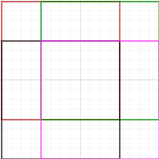

# TicTacToe BackEnd Bot

Set up an AWS Lambda which sends back an optimal move based on the current board.
Successfully create an AWS Lambda containing botLogic and the lambda functions 
included in this repo.

The api contains 1 single POST method used to get the next move, with the board state (bitmasked) as input.

## Components:
1. botLogic: Derive the next optimal move
2. handler function: Manage the invokation of the botLogic via AWS Gateway REST API
3. cache (temporary): Maintain a global cache which stores previous moves (in a specified amount of time)

2 is quite basic, and the cache is a dictionary to improve performance of repeated sequences.
The main challenge lies in the botLogic.

## State optimization/ bitmask:
Throughout the code, when the board state is needed to represent an entry in a cache
dictionary or to be received from the front-end, the state is represented by 2 numbers:
1. numX: The integer created by turning the a-th bit into 1, where boardState[a] == 'X'
2. numO: The integer created by turning the b-th bit into 1, where boardState[b] == 'O'

## botLogic Explanation:

First, we need to consider the classic case of TicTacToe on a 3x3 board:

The well-known MINIMAX algorithm (with Alpha-beta pruning) is used to derive
the best optimal move. Since there are merely around 26,000 possible games, 
the time taken to search is quite fast (with pruning), to be under 1 second.

Good resources from CS50AI (2023) about the algorithm: https://cs50.harvard.edu/ai/2024/notes/0/ 

As a "level up", I decide to create a bot for a 4x4 TicTacToe. The winning rule 
of getting 3 in a row/ column/ diagonal is kept, since getting 4 in a row/ column/ diagonal
is almost impossible to handle in the 4x4 board, making the result almost always a tie.

It's possible to keep the same MINIMAX algorithm for the new 4x4 TicTacToe, but 
it becomes quite slow: up to 37 seconds to generate the first move (with pruning and caching), which is 
too slow for the 29 seconds limit of AWS API response time.

Caching preprocessed state would easily reduce the time, yet there are far too many states
to cache, and I'd like to try another method :D

A good starting point would be Depth-limited minimax algorithm, with an utility function 
used to heuristically approximate the utility of the board (whether X or O is likely to win). 
But for TicTacToe, where only the position of the pieces matter, the utility function needs to scan all 3x3 
region to derive the utility. 

While thinking about the utility function, I try the new way:
1. Split the 4x4 board into 4 overlapping 3x3 board:

2. For each move at square (i, j): the utility of square (i, j) = The utility of the move at all the 3x3 regions it is in + The utility of not moving at the 3x3 region that it's not in.

3. The utility of a move is calculated using the Minimax algorithm. Essentially, utility of a move = final state of the board (1 if X wins, -1 if O wins, 0 if ties, assume both opponent plays optimally) * 3 ^ number of moves to reach the final state.

4. If a winning move is detected, it takes 1st priority (highest/ infinite utility).

Since the 3x3 winning rule applies, thus all the winning line should be contained in 1 of the 4 3x3 regions, making the method accurate. 

Moreover, step 2 guarantees that the effect of not moving in other 3x3 region where the move doesn't belong to is taken into account, as well as given "award" for the move that affects multiple 3x3 region (the cells in the center).

The algorithm in step 3 ensures that the winning/ losing board is ranked by how quickly it is to reach the final state, thus prioritizing the region that we can win or lose faster.

After deriving the utility of all cell, the max player chooses the cell with highest utility, while the min player chooses the lowest.

## botLogic Implementation Notes

### Special pruning: 

Since the utility of all cells is needed for the 3x3 region (so they can be added up later on), pruning can't be applied like usual minimax algorithm, which discards all cell with sub-optimal value compared to the current optimal choice.

However, this only applies to the top 2 level (or the nearest predicted 2 moves), since only these level are considered for the best next predicted moves. Deeper level can use pruning as usual, since not the exact utility of all moves in the region is needed, but only the most optimal for the calculation of the 2nd level (look at the tree in Alpha-Beta pruning of CS50AI for a better view).

### Caching:

Can still cache as usual, but since it was fast enough with correct pruning applied, I didn't implement caching due to time constraints.

## botLogic performance

With the new approach (pruning, and still no caching), the longest time taken to generate is **6-7 seconds (from 37+ seconds)**, with subsequent moves reducing to under 1 second. With caching, performance can be even higher.
